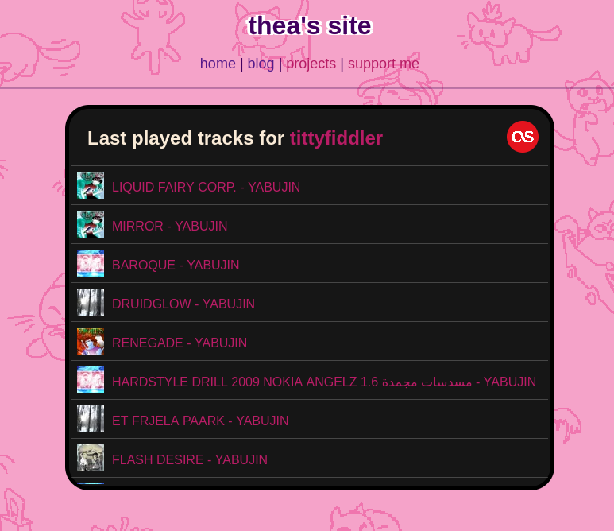
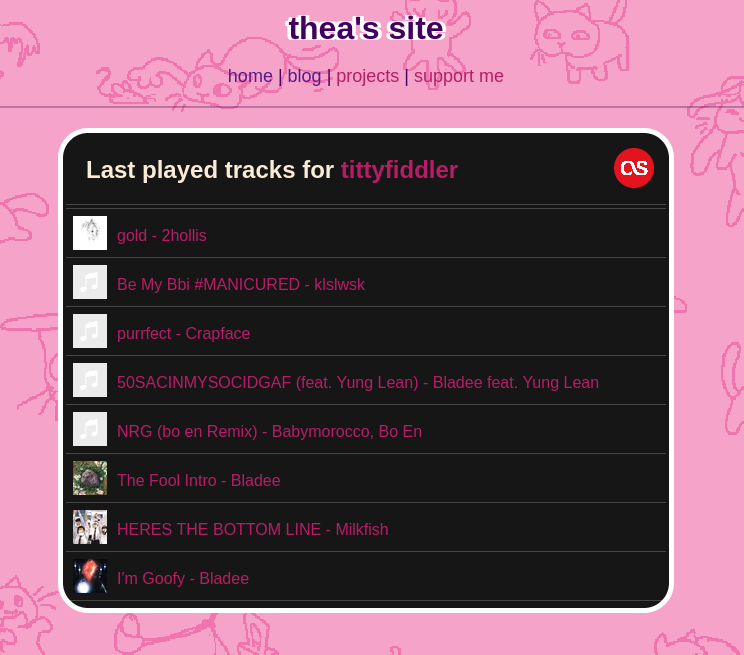
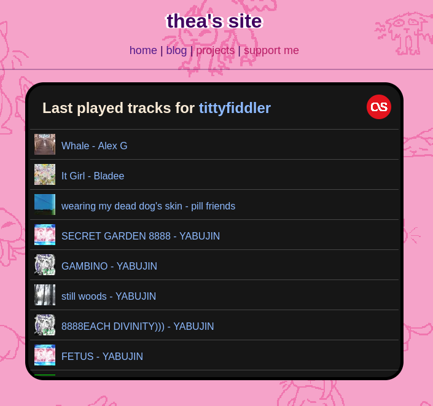

# Last.FM Web Widget

This is a short piece of javascript, css, and html to display your user's last played tracks, with a few parameters.

This repo is mostly for anyone looking for an example or template for using the Last.fm API with an application or website.

Have fun!

You can look at the widget on my website [thea.tantrum.org/last.fm](http://thea.tantrum.org/last.fm)  

## About the widget

This is what the widget looks like by default.

 

You can change the border colour of the widget with this:
```css
#lastfm-widget {
    border: 5px solid white;
}
```

 

You can change the text colour using this:

```css
#lastfm-stuff a {
    color: #8ebaff;
}
```

 

For the most part, CSS is pretty easy to read, so I wont bother with documenting every part of the script.
